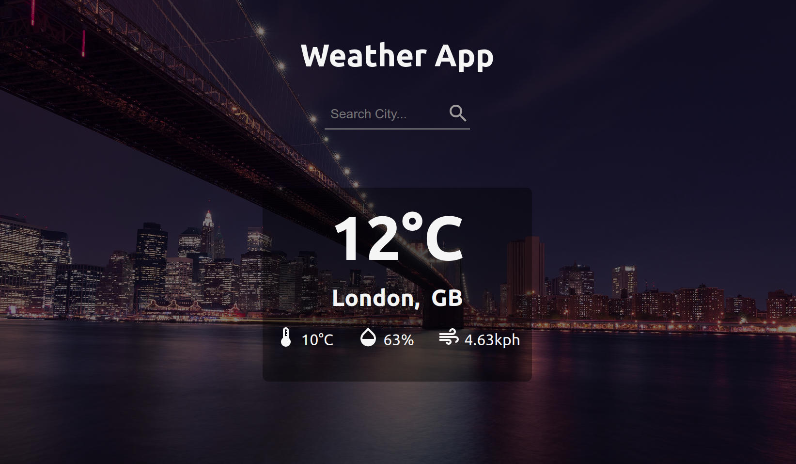
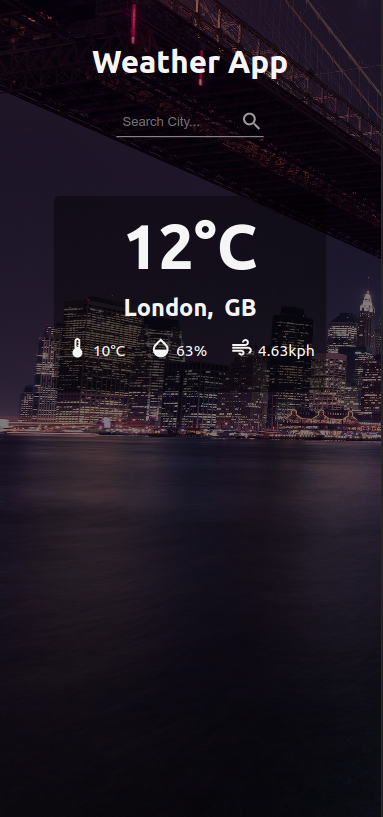

# Weather App

`Weather App` is a web application built using React.JS and CSS that allows users to get real-time weather data for any city using the `OpenWeatherAPI`. The app provides a simple and intuitive interface that enables users to search for the weather information of any city they want. Users can select any city and the app will display the current weather condition, temperature, wind speed, and other details. The app is designed to be responsive and works seamlessly across all devices, providing an excellent user experience. With Weather App, users can stay updated with the latest weather information and make informed decisions about their daily activities.

Try the application: [LIVE DEMO](https://isaaxh.github.io/weather-app)

## Installation Process

Clone the repository:

`git clone git@github.com:isaaxh/weatherApp.git`

Navigate to the project directory:

`cd weather-app`

In the project directory, you can run:

`npm start`

Runs the app in the development mode.\
Open [http://localhost:3000](http://localhost:3000) to view it in your browser.

## Screenshots

